[darwinian ventures](https://darwinian-ventures.vercel.app) &nbsp;·&nbsp;
[vesara](https://vesara-homepage.vercel.app) &nbsp;·&nbsp;
[github](https://github.com/ANDREWBTC707)

> Builder in the Bay Area. 
> AI agents for real operators. Games that hit hard.

I ship product for Darwinian Ventures — GTM systems, real-estate command 
centers, and agent fleets that run against real workflows. On the side I'm 
building Forest of Ravens, a Unity HDRP souls-like.

<samp>typescript &nbsp; csharp &nbsp; python &nbsp; react &nbsp; node &nbsp; unity &nbsp; solidity &nbsp; postgres &nbsp; docker &nbsp; git &nbsp; linux</samp>

**[FORV4](https://github.com/ANDREWBTC707/FORV4)** &nbsp;·&nbsp; <samp>csharp, unity</samp> 
Forest of Ravens — HDRP souls-like. Successor to the FORV3 web build. 
Combat, world, and systems work in progress.

**[DV-Command](https://github.com/ANDREWBTC707/DV-Command)** &nbsp;·&nbsp; <samp>typescript</samp> 
GTM outbound command center for Darwinian Ventures — pipeline, sequences, 
and operator tooling in one place.

**[DarwinianVentures](https://darwinian-ventures.vercel.app)** &nbsp;·&nbsp; <samp>typescript</samp> 
Home site for Darwinian Ventures: AI agent fleet for brokerages and 
operators who need systems, not demos.

**[VESARA](https://vesara-homepage.vercel.app)** &nbsp;·&nbsp; <samp>typescript</samp> 
Enterprise landing for Vesara AI — autonomous operating layer and trusted 
operating record.

Every graphic here is generated, not embedded from anyone else's server. 
`ascii.svg` is a photo pushed through a character ramp by 
[`scripts/make_portrait.py`](scripts/make_portrait.py); the stat graphics and 
these section headings are drawn by [a scheduled action](.github/workflows/stats.yml) 
straight from the GitHub GraphQL API, once a day, committing only what changed.

They animate with SMIL inside the SVG, because GitHub strips scripts from 
READMEs — and since nothing loads from a third party, nothing here can 
rate-limit or go dark. The headings are SVGs for the same reason: GitHub also 
strips CSS, so an image is the only way to put this page's own typeface on them.

The typeface is [JetBrains Mono](scripts/fonts), subset to just the characters 
each graphic draws and inlined as base64. That isn't only for looks: the 
portrait's grid assumes an advance width of exactly 0.600 em, and a viewer whose 
default monospace is narrower would otherwise see it squeezed.

Commit totals fold in private repositories as anonymous day counts — no repo 
names, ever. Language totals cover public repositories only. `year.svg` uses 
the portrait's character ramp: `:` `+` `#` `@`, quiet to loud.
